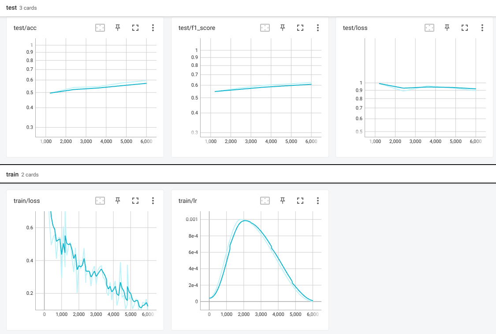

# HMS - Harmful Brain Activity Classification

## Environment Setup

Create python or conda environment
```
conda create --name hbac_env
```
```
python -m venv hbac_env
```

Install [pytorch](https://pytorch.org/)

```
conda install pytorch torchvision torchaudio pytorch-cuda=11.8 -c pytorch -c nvidia
```

```
pip3 install torch torchvision torchaudio --index-url https://download.pytorch.org/whl/cu118
```

Install required packages
```
pip install -r requirements.txt
```

## Dataset

The HBAC dataset can be obtained from the HBAC Kaggle Website ([])

## Training

The main dataloading and training pipeline can be found in [hms-pipeline](hms-pipeline.ipynb). More information on the trianing process can be found in the notebook.


Training can be monitored with Tensorboard using the following 

```
tensorboard --logdir <log directory>
```

Example of training graphs are shown below



## Results

| Model | Test KLDivLoss | Test Accuracy | Test F-1 Score |
| --- | --- | --- | --- |
